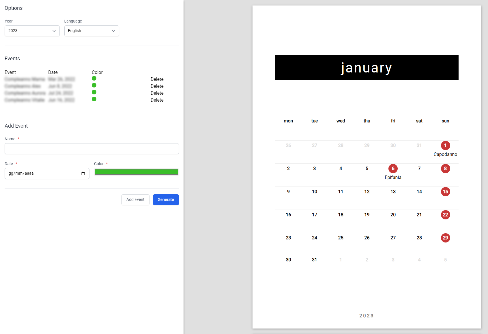

# simple-calendar

Generate a minimalist, customizable, print-ready calendar.

Features:

- 🚩 Custom Events
- 🌍 I18n

## Development server

Run `ng serve` for a dev server. Navigate to `http://localhost:4200/`. The application will automatically reload if you change any of the source files.

## Build

Run `ng build` to build the project. The build artifacts will be stored in the `dist/` directory.

# TODO

- [x] I18n
- [ ] Handle overlapping events
- [ ] Dinamically calculate Easter (Or precalculate it for the next n years 😄)
- [ ] Update Events grid (style)
- [ ] Add Holidays grid
- [ ] Make 'Add event' a modal
- [ ] Update color picker (style)
- [ ] On small screens Options and Calendar overlap

# License

This project is available under the permissive MIT license. For more info check the [LICENSE](https://github.com/alexandru-cazacu/jirello/blob/master/LICENSE).
